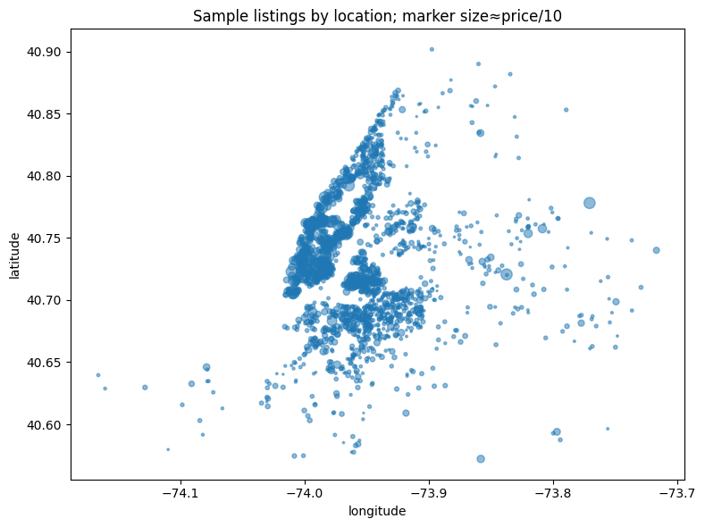

# Airbnb Price Prediction in New York City

Predicting NYC Airbnb prices using Linear Regression, Random Forest &amp; Gradient Boosting. EDA revealed location &amp; room type drive pricing. Models captured non-linear relationships, with Random Forest performing best (R²=0.628). Data cleaning, feature engineering, and model evaluation included.

---

## 📌 Project Overview

This project focuses on building regression models to predict Airbnb listing prices in New York City based on listing characteristics such as:

* Location
* Room type
* Availability
* Review activity
* Host listing count
* Geographic coordinates

The workflow includes:

* Data Cleaning
* Missing Value Handling
* Feature Engineering
* Exploratory Data Analysis (EDA)
* Outlier Treatment
* Log Transformation
* Machine Learning Modeling
* Model Evaluation & Comparison

The final models compared include:

* Linear Regression
* Random Forest Regressor
* Gradient Boosting Regressor

---

# 📂 Dataset

The dataset contains Airbnb listing information such as:

| Feature              | Description                      |
| -------------------- | -------------------------------- |
| neighbourhood_group  | Borough in NYC                   |
| neighbourhood        | Specific area                    |
| room_type            | Entire home/private/shared       |
| price                | Listing price                    |
| minimum_nights       | Minimum booking nights           |
| number_of_reviews    | Total reviews                    |
| reviews_per_month    | Monthly review activity          |
| availability_365     | Availability throughout the year |
| latitude & longitude | Geographic coordinates           |

---
## Machine Learning Models

* Linear Regression
* Random Forest Regressor
* Gradient Boosting Regressor

---

# 🧹 Data Cleaning & Preprocessing

## 1. Removed Unnecessary Columns

The following columns were removed because they do not contribute meaningfully to prediction:

```python
['id', 'name', 'host_id', 'host_name']
```

---

## 2. Missing Value Investigation

The following Features had missing values:

| Column            | Missing Values |
| ----------------- | -------------- |
| last_review       | 10,052         |
| reviews_per_month | 10,052         |
| host_name         | 21             |
| name              | 16             |

### Key Observation

After investigation, all rows with missing `reviews_per_month` had zero number of `number_of_reviews`  rows and this might indicate that missing values were logically caused by listings having no reviews. So instead of dropping over 10,000 rows (~21% of the dataset), I investigated the pattern behind the missing values first. This was an important analytical step because blindly removing rows would have caused unnecessary data loss.

I verified the hypothesis using by checking if all the columns with `reviews_per_month` and `number_of_reviews` which are empty equal to null and it turned out to be true. Hence, this confirmed that imputing missing values with `0` was logically correct.

---

## 3. Feature Engineering

### Date Features Extracted

The `last_review` column was converted to datetime and transformed into useful numerical features:

* `days_since_last_review`
* `last_review_year`
* `last_review_month`

This Was done because machine learning models cannot directly interpret raw date strings effectively so transforming dates into numerical representations was the right step to do because it helps models learn temporal patterns more efficiently.

---

# 📊 Exploratory Data Analysis (EDA)

## Price Distribution

Airbnb prices were heavily right-skewed due to extremely expensive listings, so to improve model stability, I capped Prices  at the 99th percentile and applied Log transformation. Because Without these special treatment, luxury listings would dominate model learning and distort predictions.

---

##  Original vs Capped Price Distribution


### Insight

The capped distribution removes the extreme long tail while preserving the overall structure of pricing behavior.

---

## Log-Transformed Price Distribution


### Insight

Log transformation reduced skewness and created a more normal-like distribution, improving regression performance.

---

# 🏠 Room Type vs Price


### Key Findings

* Entire homes/apartments had the highest median prices
* Shared rooms were the cheapest
* Private rooms occupied the middle range

### Observation

Room type emerged as one of the strongest predictors of Airbnb pricing.

---

# 🗺️ Geographic Price Distribution



### Key Findings

* Manhattan contained the densest cluster of expensive listings
* Outer boroughs generally showed lower pricing
* Larger markers represented higher-priced listings


So, instead of only analyzing borough names, I wanted to visually inspect whether geographic coordinates themselves encoded pricing behavior. This helped me confirmed that spatial location is a major pricing driver.

---

# 📈 Correlation Heatmap


### Key Findings

Most numerical variables had weak linear correlations with price.

Examples:

| Feature           | Correlation with Price |
| ----------------- | ---------------------- |
| number_of_reviews | -0.06                  |
| reviews_per_month | -0.06                  |
| availability_365  | +0.12                  |

This suggested that Airbnb pricing depends more on:

* Nonlinear relationships
* Spatial effects
* Categorical interactions

This justified trying ensemble-based machine learning models.

---

# 🤖 Machine Learning Models

## 1. Linear Regression

### Performance

| Metric | Score  |
| ------ | ------ |
| MAE    | 0.3285 |
| RMSE   | 0.4425 |
| R²     | 0.5672 |

### Interpretation

Linear Regression served as a strong baseline but struggled to capture nonlinear pricing behavior.

---

## 2. Random Forest Regressor

### Performance

| Metric | Score  |
| ------ | ------ |
| MAE    | 0.2993 |
| RMSE   | 0.4102 |
| R²     | 0.6281 |

### Interpretation

Random Forest performed best overall.

It captured:

* nonlinear feature interactions
* spatial relationships
* complex pricing patterns

better than Linear Regression.

---

## 3. Gradient Boosting Regressor

### Performance

| Metric | Score  |
| ------ | ------ |
| MAE    | 0.3104 |
| RMSE   | 0.4206 |
| R²     | 0.6091 |

### Interpretation

Gradient Boosting improved upon Linear Regression but slightly underperformed Random Forest on this dataset.

---

# 🏆 Final Model Comparison

| Model             | MAE        | RMSE       | R²         |
| ----------------- | ---------- | ---------- | ---------- |
| Linear Regression | 0.3285     | 0.4425     | 0.5672     |
| Random Forest     | **0.2993** | **0.4102** | **0.6281** |
| Gradient Boosting | 0.3104     | 0.4206     | 0.6091     |

---

# 💡 Key Learnings

## What Worked Well

* Investigating missing values before imputation
* Outlier capping improved model stability
* Log transformation improved prediction performance
* Ensemble models captured nonlinear relationships effectively

---

## Challenges

### Handling Missing Values

One major challenge was deciding how to treat over 10,000 missing values in `reviews_per_month` and `last_review`.

Instead of immediately removing rows, I explored *why* the values were missing and discovered the missingness was systematic rather than random.
This analytical step preserved a significant portion of the dataset.

---

### Skewed Target Variable

The `price` variable contained extreme luxury listings reaching up to `$10,000`.
This created severe skewness and risked biasing the model.

To solve this:

* I capped prices at the 99th percentile
* Applied log transformation

This significantly stabilized the target distribution.

---

### Weak Linear Correlations

The heatmap revealed weak linear relationships between numeric variables and price.

This suggested:

* linear regression alone would be insufficient
* nonlinear models would likely perform better

This insight guided the transition toward Random Forest and Gradient Boosting models.

---

# 🚀 Future Improvements

Potential enhancements include:

* Hyperparameter tuning using GridSearchCV or RandomizedSearchCV
* XGBoost or LightGBM implementation
* Geospatial clustering
* NLP analysis on listing descriptions
* Feature importance visualization
* Cross-validation for more robust evaluation

---

# 📌 Conclusion

This project demonstrates how thoughtful preprocessing, feature engineering, and model selection can improve predictive performance in real-world pricing problems.

The strongest insight from this analysis was that Airbnb prices are driven less by simple numeric counts and more by complex interactions between:

* location
* room type
* availability
* host activity
* spatial patterns

Among all tested models, Random Forest achieved the best overall performance, confirming the importance of nonlinear modeling approaches for Airbnb price prediction.

---

# 👩‍💻 Author

**Latifah Usaini Bashir**

* Data Analyst Enthusiast


