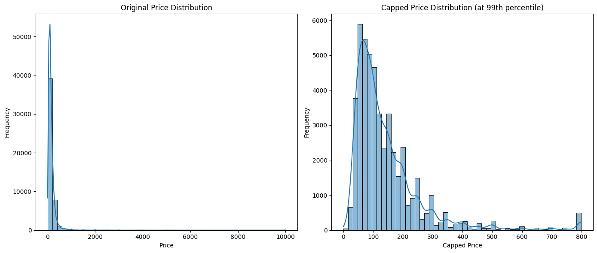
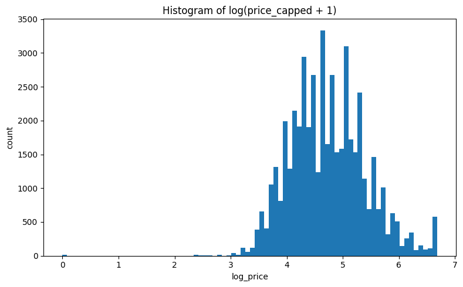
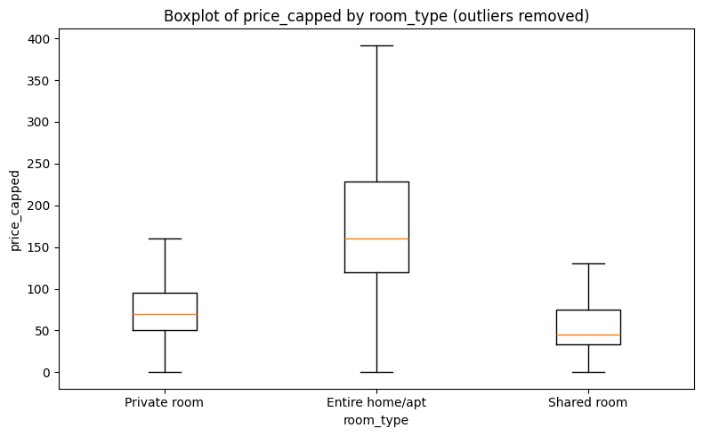
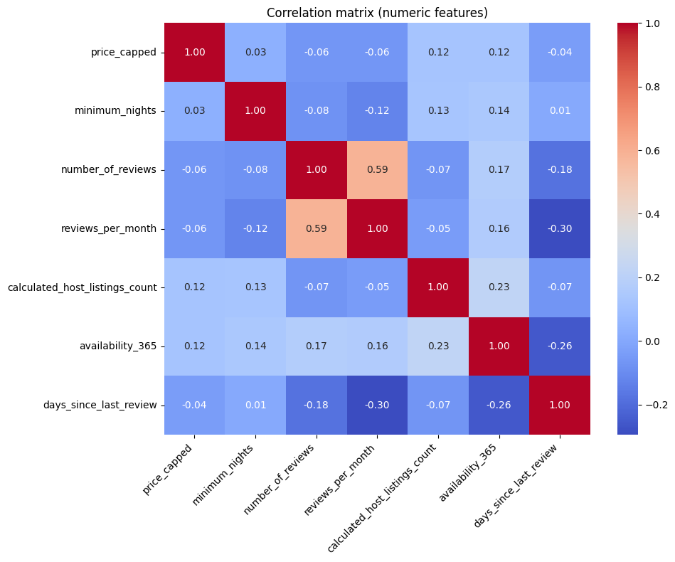

# Airbnb-NYC-Price-Prediction
Predicting NYC Airbnb prices using Linear Regression, Random Forest &amp; Gradient Boosting. EDA revealed location &amp; room type drive pricing. Models captured non-linear relationships, with Random Forest performing best (R²=0.628). Data cleaning, feature engineering, and model evaluation included.


# 🏠 Airbnb Price Prediction in New York City

This project focuses on predicting Airbnb listing prices in New York City using Machine Learning techniques. The workflow covers data cleaning, feature engineering, exploratory data analysis (EDA), preprocessing, model building, and evaluation using multiple regression algorithms.

The goal of the project is to understand the major factors influencing Airbnb pricing and build predictive models capable of estimating listing prices accurately.

---

# 📌 Project Overview

Airbnb prices are influenced by several factors such as:

- Location
- Room type
- Availability
- Review activity
- Host listing count
- Geographic coordinates

In this project, I explored these relationships and trained different machine learning models to predict listing prices.

The workflow includes:

- Data Cleaning
- Missing Value Handling
- Feature Engineering
- Exploratory Data Analysis (EDA)
- Outlier Treatment
- Log Transformation
- Model Training & Evaluation
- Performance Comparison

---

# 📂 Dataset Information

The dataset contains Airbnb listings in New York City with features such as:

| Feature | Description |
|---|---|
| neighbourhood_group | Borough of the listing |
| neighbourhood | Specific neighborhood |
| latitude / longitude | Geographic coordinates |
| room_type | Entire home, private room, shared room |
| price | Listing price |
| minimum_nights | Minimum nights required |
| number_of_reviews | Total reviews |
| reviews_per_month | Average monthly reviews |
| availability_365 | Availability throughout the year |
| calculated_host_listings_count | Number of listings owned by host |

---

# 🧹 Data Cleaning & Preprocessing

## Missing Values

The following missing values were identified:

| Column | Missing Values |
|---|---|
| last_review | 10,052 |
| reviews_per_month | 10,052 |
| host_name | 21 |
| name | 16 |

### Handling Strategy

- Removed unnecessary columns:
  - `id`
  - `name`
  - `host_id`
  - `host_name`

- Missing values in `reviews_per_month` were filled with `0` because all missing rows had:
  - `number_of_reviews = 0`

- Converted `last_review` into datetime format and extracted:
  - `days_since_last_review`
  - `last_review_year`
  - `last_review_month`

- Dropped the original `last_review` column after feature extraction.

---

# ⚙️ Feature Engineering

Additional features created:

| Feature | Description |
|---|---|
| days_since_last_review | Number of days since latest review |
| last_review_year | Review year |
| last_review_month | Review month |

---

# 📊 Exploratory Data Analysis (EDA)

## 1️⃣ Price Distribution

To reduce the impact of extreme outliers:

- Prices were capped at the 99th percentile
- A log transformation was applied

This helped reduce skewness and improve model learning.

### 📷 Original vs Capped Price Distribution



### 📷 Log Transformed Price Distribution



---

## 2️⃣ Room Type vs Price

The analysis showed:

- Entire homes/apartments are the most expensive
- Private rooms are moderately priced
- Shared rooms are the cheapest

### 📷 Boxplot of Price by Room Type



---

## 3️⃣ Neighborhood Price Analysis

Average prices by borough:

| Borough | Mean Price |
|---|---|
| Manhattan | \$182.95 |
| Brooklyn | \$119.37 |
| Staten Island | \$101.80 |
| Queens | \$96.10 |
| Bronx | \$85.75 |

Manhattan listings are significantly more expensive than other boroughs.

---

## 4️⃣ Reviews vs Price

There was no strong relationship between:
- Number of reviews
- Listing price

### 📷 Price vs Number of Reviews


---

## 5️⃣ Geographic Price Distribution

Geographic visualization revealed:

- Manhattan contains most high-priced listings
- Outer boroughs generally contain lower-priced listings

### 📷 Spatial Listing Distribution


---

## 6️⃣ Correlation Analysis

Correlation analysis showed weak linear relationships between price and most numerical variables, suggesting that:

- Non-linear models may perform better
- Categorical & spatial features are highly important

### 📷 Correlation Heatmap



---

# 🤖 Machine Learning Models

The target variable used for prediction was:

```python
log_price = log(price_capped + 1)
````

---

# 🔧 Preprocessing Pipeline

The preprocessing pipeline included:

### Numerical Features

* Median Imputation

### Categorical Features

* Missing value replacement using `"UNKNOWN"`
* One-Hot Encoding

---

# 📈 Models Used

## 1️⃣ Linear Regression

### Results

| Metric   | Score  |
| -------- | ------ |
| MAE      | 0.3285 |
| RMSE     | 0.4425 |
| R² Score | 0.5672 |

### Interpretation

Linear Regression served as a solid baseline model but struggled to capture complex non-linear pricing patterns.

---

## 2️⃣ Random Forest Regressor ⭐ Best Model

### Results

| Metric   | Score  |
| -------- | ------ |
| MAE      | 0.2993 |
| RMSE     | 0.4102 |
| R² Score | 0.6281 |

### Interpretation

Random Forest achieved the best overall performance by capturing:

* Non-linear relationships
* Feature interactions
* Spatial pricing behavior

---

## 3️⃣ Gradient Boosting Regressor

### Results

| Metric   | Score  |
| -------- | ------ |
| MAE      | 0.3104 |
| RMSE     | 0.4206 |
| R² Score | 0.6091 |

### Interpretation

Gradient Boosting also performed well but slightly below Random Forest.

---

# 🏆 Final Model Comparison

| Model             | MAE    | RMSE   | R² Score |
| ----------------- | ------ | ------ | -------- |
| Linear Regression | 0.3285 | 0.4425 | 0.5672   |
| Random Forest     | 0.2993 | 0.4102 | 0.6281   |
| Gradient Boosting | 0.3104 | 0.4206 | 0.6091   |

---

# ✅ Conclusion

This project demonstrates that Airbnb pricing is influenced by a combination of:

* Location
* Room type
* Availability
* Host activity
* Spatial factors

Key findings include:

* Manhattan listings command the highest prices
* Entire homes are significantly more expensive
* Numerical review features alone are weak predictors
* Non-linear machine learning models outperform linear regression

Among all tested models, **Random Forest Regressor** achieved the best performance.

---

# 🛠️ Technologies Used

* Python
* Pandas
* NumPy
* Matplotlib
* Seaborn
* Scikit-learn
* Google Colab

---

# 📁 Project Structure

```bash
├── data/
│   └── airbnb.csv
├── images/
│   ├── price_distribution.png
│   ├── log_price_distribution.png
│   ├── room_type_boxplot.png
│   ├── price_vs_reviews.png
│   ├── spatial_distribution.png
│   └── correlation_heatmap.png
├── notebook/
│   └── airbnb_price_prediction.ipynb
├── README.md
```

---

# 🚀 Future Improvements

Possible future enhancements include:

* Hyperparameter tuning
* XGBoost or LightGBM implementation
* Advanced geospatial feature engineering
* NLP analysis on listing descriptions
* Deployment as a web application

---

# 👩‍💻 Author

Latifah Usaini Bashir


````

